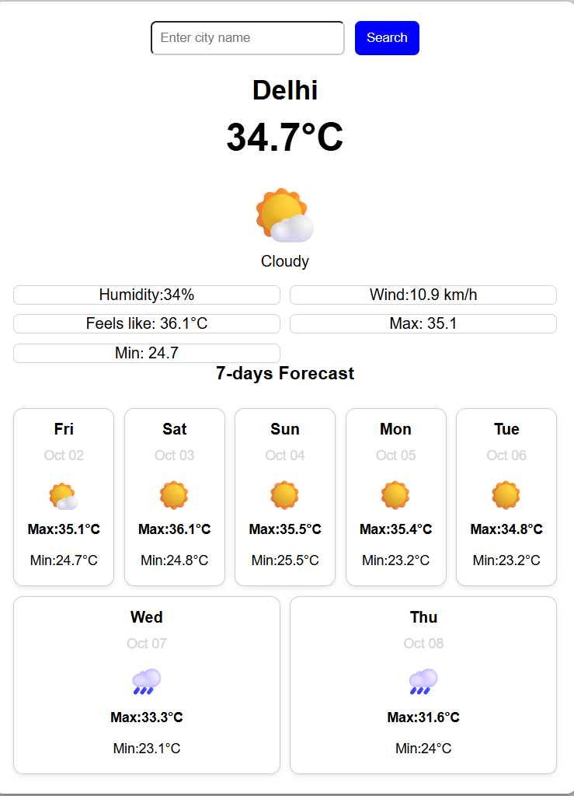

# Weather App
A simple and responsive Weather App built using HTML,CSS and JavaScript.

## Features
- Search weather by city name
- Displays current temperature
- Shows weather condition and icon
- Displays humidity 
- Displays wind speed
- show feels-like temperature 
- Shows today's maximum and minimum temperature 
- 7-day weather forecast 
- Responsive design for mobile and desktop
- Enter key support for searching

## Technologies Used
- HTML
- CSS
- JavaScript
- Open-Meteo API

## How to Run

1.Download or clone this repository.
2.Open the project folder.
3.Open `index.html` in a web browser.
4.Enter a city name and click Search.

## API
Weather data is provided by the Open-Meteo API.

## Author
Vishnu
